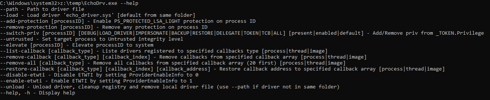
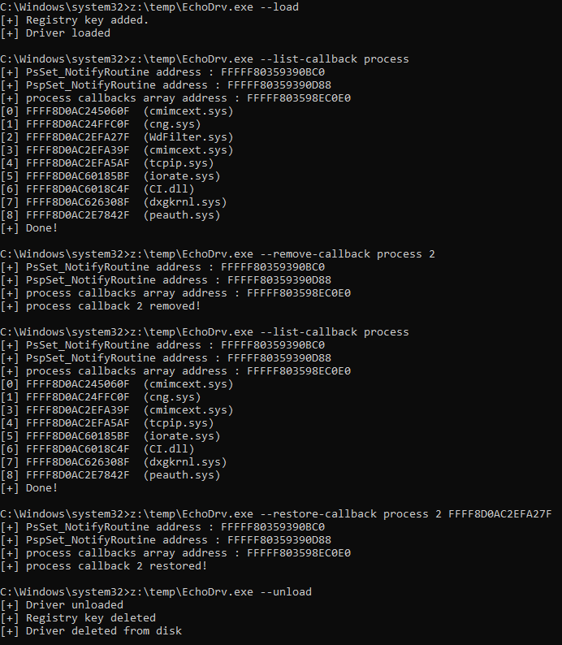

# EchoDrv

----

Tool permitting to abuse Kernel read/write vulnerability in ECHOAC anti-cheat driver (echo_driver.sys).

## Usage

## Example

## Credits
-  Kite03 for the vulnerability discovery in [echo_driver.sys](https://ioctl.fail/echo-ac-writeup/)
- <https://www.matteomalvica.com/blog/2020/07/15/silencing-the-edr/> (callbacks)
- <http://blog.deniable.org/posts/windows-callbacks/> (callbacks)
- <https://medium.com/@VL1729_JustAT3ch/removing-process-creation-kernel-callbacks-c5636f5c849f> (callbacks kernel pattern)
- <https://securityintelligence.com/posts/direct-kernel-object-manipulation-attacks-etw-providers/> (ETW-TI)
- <https://www.ired.team/miscellaneous-reversing-forensics/windows-kernel-internals/how-kernel-exploits-abuse-tokens-for-privilege-escalation>

## Disclaimer
This software has been created purely for the purposes of academic research and for the development of effective defensive techniques, and is not intended to be used to attack systems except where explicitly authorized. Project maintainers are not responsible or liable for misuse of the software. Use responsibly.
